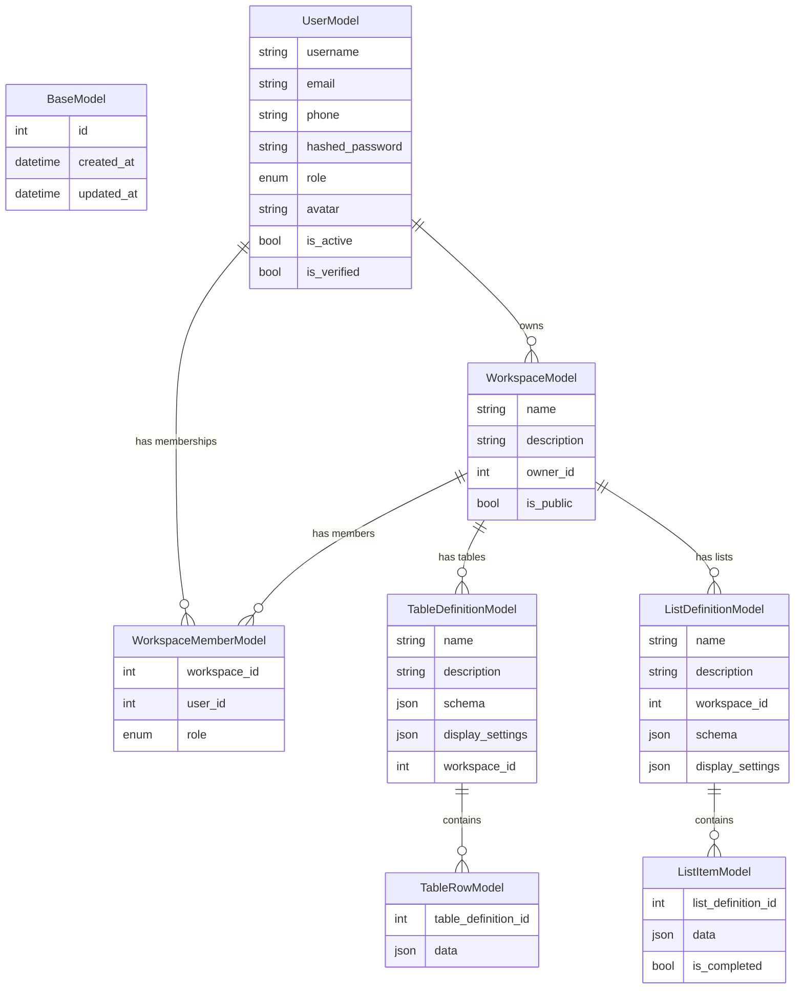

```mermaid
erDiagram
    BaseModel {
        int id
        datetime created_at
        datetime updated_at
    }

    UserModel ||--o{ WorkspaceModel : "owns"
    UserModel ||--o{ WorkspaceMemberModel : "has memberships"
    UserModel {
        string username
        string email
        string phone
        string hashed_password
        enum role
        string avatar
        bool is_active
        bool is_verified
    }

    WorkspaceModel ||--o{ WorkspaceMemberModel : "has members"
    WorkspaceModel ||--o{ TableDefinitionModel : "has tables"
    WorkspaceModel ||--o{ ListDefinitionModel : "has lists"
    WorkspaceModel {
        string name
        string description
        int owner_id
        bool is_public
    }

    WorkspaceMemberModel {
        int workspace_id
        int user_id
        enum role
    }

    TableDefinitionModel ||--o{ TableRowModel : "contains"
    TableDefinitionModel {
        string name
        string description
        json schema
        json display_settings
        int workspace_id
    }

    TableRowModel {
        int table_definition_id
        json data
    }

    ListDefinitionModel ||--o{ ListItemModel : "contains"
    ListDefinitionModel {
        string name
        string description
        int workspace_id
        json schema
        json display_settings
    }

    ListItemModel {
        int list_definition_id
        json data
        bool is_completed
    }
```