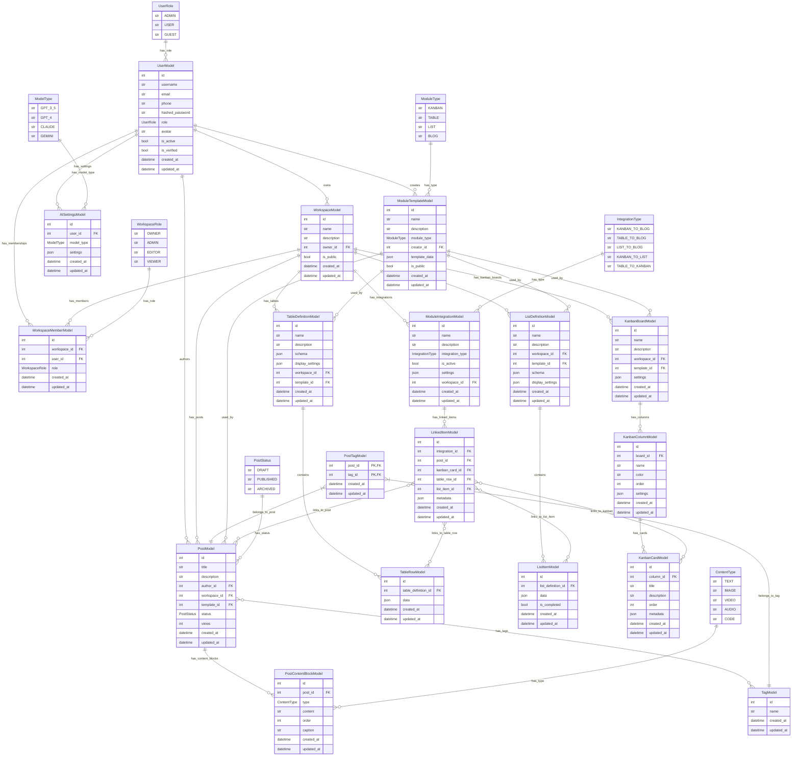

Эта диаграмма показывает все связи между твоими моделями:

1. Пользователи и рабочие пространства:

- Пользователь может владеть несколькими рабочими пространствами
- Пользователь может быть участником нескольких рабочих пространств
- Пользователь может быть автором нескольких постов

2. Рабочие пространства:

- Рабочее пространство может иметь несколько участников
- Рабочее пространство может содержать таблицы, списки, канбан-доски, посты
- Рабочее пространство может иметь несколько интеграций между модулями

3. Модули:

- Таблицы: Определение таблицы содержит строки
- Списки: Определение списка содержит элементы списка
- Канбан: Канбан-доска содержит колонки, которые содержат карточки
- Блог: Пост содержит блоки контента и может иметь теги

4. Интеграции:

- Интеграция может связывать различные элементы из разных модулей
- Связанный элемент может ссылаться на пост, карточку канбана, строку таблицы или элемент списка

Эта структура позволяет создавать гибкие рабочие пространства, где пользователи могут выбирать, какие модули им нужны, и настраивать интеграции между ними.