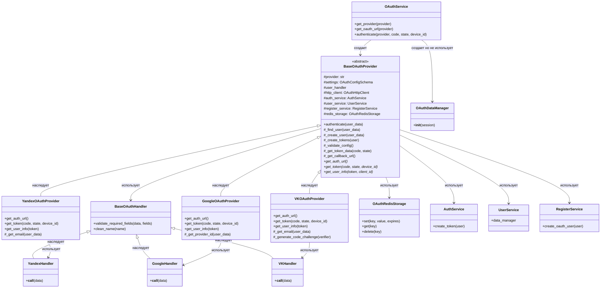

```mermaid
classDiagram
    class OAuthService {
        +get_provider(provider)
        +get_oauth_url(provider)
        +authenticate(provider, code, state, device_id)
    }
    
    class BaseOAuthProvider {
        <<abstract>>
        #provider: str
        #settings: OAuthConfigSchema
        #user_handler
        #http_client: OAuthHttpClient
        #auth_service: AuthService
        #user_service: UserService
        #register_service: RegisterService
        #redis_storage: OAuthRedisStorage
        +authenticate(user_data)
        #_find_user(user_data)
        #_create_user(user_data)
        #_create_tokens(user)
        #_validate_config()
        #_get_token_data(code, state)
        #_get_callback_url()
        +get_auth_url()* 
        +get_token(code, state, device_id)*
        +get_user_info(token, client_id)*
    }
    
    class YandexOAuthProvider {
        +get_auth_url()
        +get_token(code, state, device_id)
        +get_user_info(token)
        #_get_email(user_data)
    }
    
    class GoogleOAuthProvider {
        +get_auth_url()
        +get_token(code, state, device_id)
        +get_user_info(token)
        #_get_provider_id(user_data)
    }
    
    class VKOAuthProvider {
        +get_auth_url()
        +get_token(code, state, device_id)
        +get_user_info(token)
        #_get_email(user_data)
        #_generate_code_challenge(verifier)
    }
    
    class BaseOAuthHandler {
        +validate_required_fields(data, fields)
        +clean_name(name)
    }
    
    class YandexHandler {
        +__call__(data)
    }
    
    class GoogleHandler {
        +__call__(data)
    }
    
    class VKHandler {
        +__call__(data)
    }
    
    class OAuthDataManager {
        +__init__(session)
    }
    
    class OAuthRedisStorage {
        +set(key, value, expires)
        +get(key)
        +delete(key)
    }
    
    class AuthService {
        +create_token(user)
    }
    
    class UserService {
        +data_manager
    }
    
    class RegisterService {
        +create_oauth_user(user)
    }
    
    OAuthService --> BaseOAuthProvider : создает
    BaseOAuthProvider <|-- YandexOAuthProvider : наследует
    BaseOAuthProvider <|-- GoogleOAuthProvider : наследует
    BaseOAuthProvider <|-- VKOAuthProvider : наследует
    
    BaseOAuthProvider --> BaseOAuthHandler : использует
    BaseOAuthHandler <|-- YandexHandler : наследует
    BaseOAuthHandler <|-- GoogleHandler : наследует
    BaseOAuthHandler <|-- VKHandler : наследует
    
    BaseOAuthProvider --> OAuthRedisStorage : использует
    BaseOAuthProvider --> AuthService : использует
    BaseOAuthProvider --> UserService : использует
    BaseOAuthProvider --> RegisterService : использует
    
    OAuthService --> OAuthDataManager : создает но не использует
    
    YandexOAuthProvider --> YandexHandler : использует
    GoogleOAuthProvider --> GoogleHandler : использует
    VKOAuthProvider --> VKHandler : использует

```